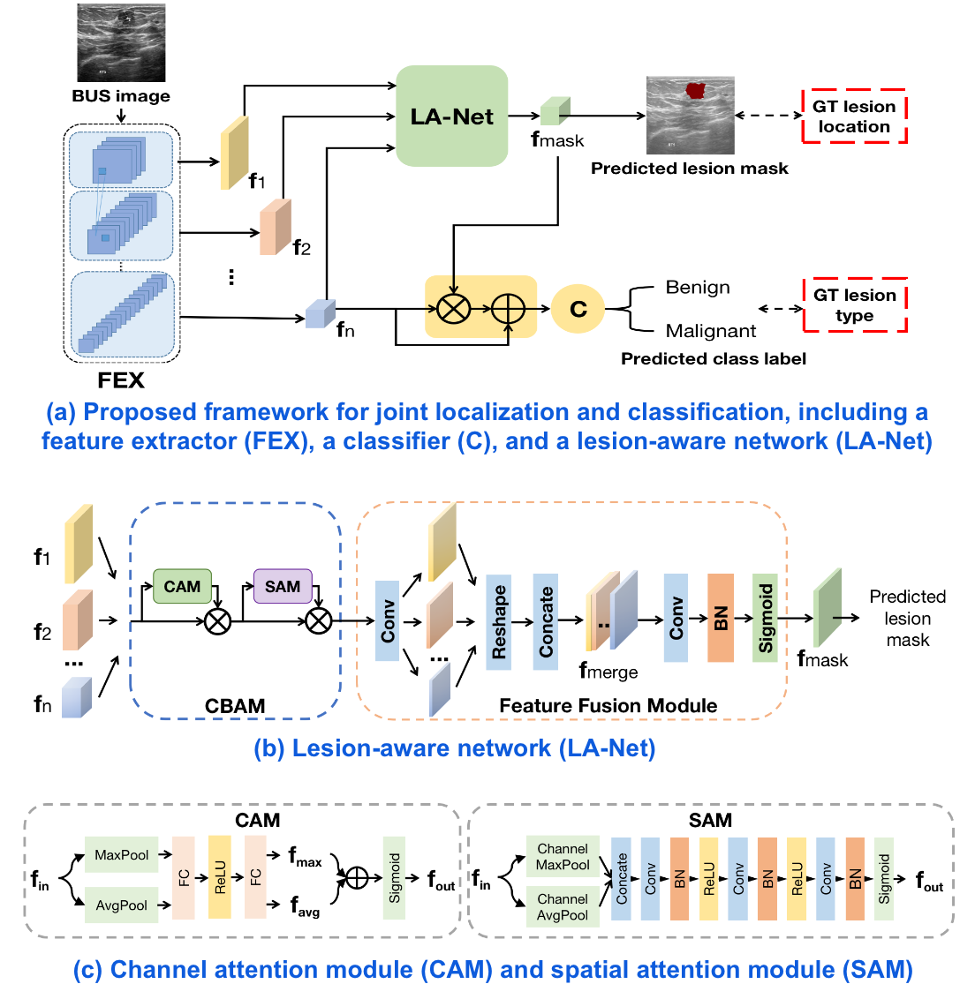
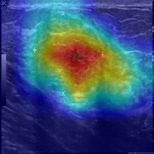

# Joint localization and classification of breast masses on ultrasound images using an auxiliary attention-based framework ([paper](https://www.sciencedirect.com/science/article/pii/S1361841523002207))

## Network Architecture


## Requirements
The code is validated under this environment:
- Python 3.8.3, CUDA Toolkit 11.5
- Python packages are shown in the `requirements.txt`

## How to use
### 1. Data preparation
BUSI dataset is publically available now. MBUD is still applying permit to be released.

**BUSI**
- Download link: [Breast Ultrasound Images Dataset](https://www.kaggle.com/datasets/aryashah2k/breast-ultrasound-images-dataset)
- Data format: NOTE we only use *benign* and *malignant* classes
```
- benign
    \__ benign (1).png
    |__ benign (1)_mask.png
    |__ ...
-malignant
    \__ malignant (1).png
    |__ malignant (1)_mask.png
    |__ ...
```

- Train file example: `data/busi_train_binary.txt` with format `image_path,class`, e.g. `Dataset_BUSI_with_GT/benign/benign (82).png,benign`; `data/busi_train_binary_bbox.txt` with format`image_path,class,bbox_coordinates`, e.g. `Dataset_BUSI_with_GT/benign/benign (262).png,benign,50:133:428:277`. The former is used for training using segmentation contours as localization label; the later is used for training using bounding boxes as as localization labels. 

### 2. Pretrain LA-Net

Run `bash run_train_lanet.sh` with the given arguments:
- `model_name`: pretrained LA-Net name, `resnet18_cbam_mask` or `resnet50_cbam_mask` 
- `image_size`: input image size 
- `num_classes`: total number classes of the dataset 
- `batch_size`: traning batch size
- `num_epochs`: number of training epochs
- `model_save_path`: directory to save the trained model weights
- `device`: which GPU card to use, default: `cuda:0`
- `lr`: initial learning rate, default: `1e-4`, 
- `use_pretrained`: use ImageNet pretrained weights for ResNet or not, default: True
- `pretrained_weights`: resumed model weights path, default: ""
- `backbone_weights`: resumed ResNet weights path, default: ""
- `lanet_weights`: resumed LA-Net weight path, default: ""
- `dataset`: dataset name. Currently only `BUSI`
- `num_gpus`: number of GPUs to use, default: 1 
- `dilute_mask`: number of pixels to dilute the mask as data augmentation, default: 0
- `use_cam`: use CAM in LA-Net or not, default: True
- `use_sam`: use SAM in LA-Net or not, default: True
- `use_mam`: use MAM in LA-Net or not, default: True 
- `map_size`: the size of logit feature map. For ResNet, it equals to `image_size//32`
- `reduction_ratio`: the reduction rate of channel compression in CAM, default: 16 
- `attention_kernel_size`: attention kernel size in SAM, default: 3
- `attention_num_conv`: the number of conv layer in SAM, default: 3

NOTE: the train and test files can be modified in `train_lanet.py` between line 155 to 162. 

### 3. Train the ResNet+LA-Net for joint classification and localization

Run `bash train.sh` with parameters:
- `mask_weight`: weighting coefficient to balance the classification and localization losses, default: 1.0
- `pseudo_conf`: class confidence threshold to determine if the predicted mask is reliabe to be used as psedudo labeling based on the class branch, default: 0.8
- `pseudo_mask_weight`: weighting coeffient to balance the loss from the pseudo mask labels and GT mask labels, default: 0.1
The other parameters are the same decribed in previous step 2.

NOTE the pretrained LA-Net model weights should be loaded via argument `lanet_weights`. The train and test files can be modified in `train_lanet.py` between line 196 to 209. 

### 4. Model evaluation

For classification performance, run `bash run_eval_cls.sh` with arguments: 
- `model_weights`: model path to the model to be assessed
- `multi_gpu`: define if the model is trained using multiple GPUs, default: False 
- `adv_attack`: use [PGD attack](https://github.com/Harry24k/adversarial-attacks-pytorch) or not, default: False 
- `test_file`: test file

For localization performance, run `bash run_eval_loc.sh` with the same argmuments

### 5. Visualization
Visualize the predicted image masks, run `bash vis_pred_mask.sh`

Visualize the saliency map of an input image via Grad-CAM, run `bash vis_saliency.sh`

  

## Citation
If you use this paper and code, please cite the following BibTex: 
> Fan, Zong, et al. "Joint localization and classification of breast masses on ultrasound images using an auxiliary attention-based framework." Medical image analysis 90 (2023): 102960.


### Recommened repositories

- BAM and CBAM: https://github.com/Jongchan/attention-module/tree/master
- Adversarial attack packages: https://github.com/Harry24k/adversarial-attacks-pytorch
- PyTorch UNet: https://github.com/milesial/Pytorch-UNet/releases
- PyTorch image models: https://github.com/huggingface/pytorch-image-models#models
